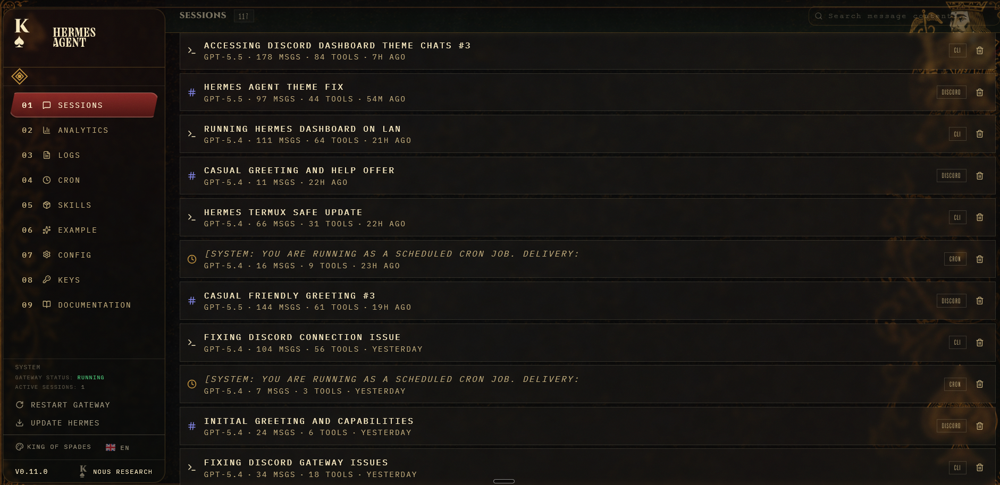
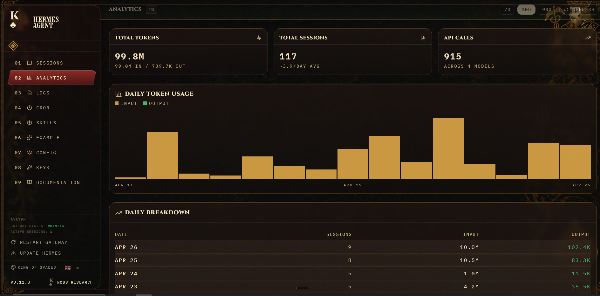
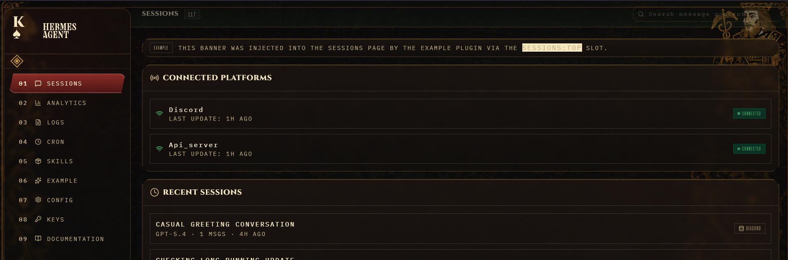

# King of Spades

A cinematic playing-card theme for Hermes Dashboard: dark casino table, antique gold borders, burgundy suit accents, transparent glass panels, and readable card-style chrome.

This repo is Daedalus-style in layout, but includes a tiny hidden dashboard plugin because the background image is too large and valuable to inline into YAML.

## Preview

### Sessions



### Analytics



### Sessions with plugin panel



Reference assets are included here:

- `plugin/king-of-spades/dashboard/assets/references/card_background.png`
- `plugin/king-of-spades/dashboard/assets/references/default_dashboard.png`
- `plugin/king-of-spades/dashboard/assets/references/target_mockup.png`

## Install

From the repo root on the machine running Hermes:

```bash
./install.sh
```

Or install manually:

```bash
mkdir -p ~/.hermes/dashboard-themes
mkdir -p ~/.hermes/plugins/king-of-spades
cp theme/king-of-spades.yaml ~/.hermes/dashboard-themes/king-of-spades.yaml
cp -R plugin/king-of-spades/dashboard ~/.hermes/plugins/king-of-spades/dashboard
```

Then restart the Hermes gateway/dashboard and select `King of Spades` from the dashboard theme picker.

## Files

```text
theme/king-of-spades.yaml
plugin/king-of-spades/dashboard/manifest.json
plugin/king-of-spades/dashboard/dist/index.js
plugin/king-of-spades/dashboard/assets/card-background.png
```

## Notes

- The plugin is intentionally hidden and only serves image assets at `/dashboard-plugins/king-of-spades/...`.
- All visual styling lives in `theme/king-of-spades.yaml`.
- No Hermes dashboard source files are modified.

## License

MIT
